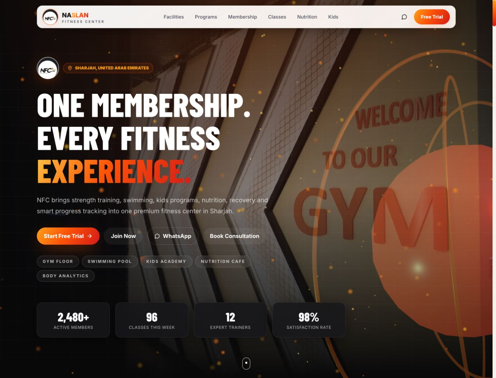
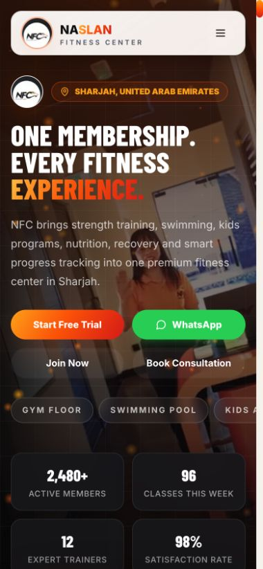

# Al Naslan Fitness Center (NFC)

Website for **Al Naslan Fitness Center** — Al Mawja Tower, Al Taawun, Sharjah, UAE.

🔗 **Live:** https://naslanfitnesscenter.com

## Screenshots

### Desktop


### Mobile


## Stack

- **Next.js 14** (App Router) + **TypeScript**
- **Tailwind CSS** for styling
- **Framer Motion** / **GSAP** for animation
- **lucide-react** for icons
- Deployed on **Vercel**

## Run Locally

```bash
npm install
npm run dev
```

Open http://localhost:3000

## Production Build

```bash
npm run build
npm start
```

## Project Structure

```
app/                    Next.js App Router pages and API routes
  page.tsx              Homepage — composes every section in order
  api/chat/             Chatbot endpoint (falls back to lib/ai.ts)
  api/lead/             Free-trial lead capture
components/
  sections/             Page sections (Hero, Facilities, Membership, Cafe…)
  ChatWidget.tsx        FAQ chatbot, bottom-right
  CafeGallery.tsx       Naslan Café photo catalogue + lightbox
lib/
  data.ts               ★ ALL site content lives here
  ai.ts                 Chatbot answers (rule-based)
public/media/           Photos, grouped by area
```

## Editing Content

**Almost everything you'd want to change is in [`lib/data.ts`](lib/data.ts)** — no component edits needed:

| What | Where in `lib/data.ts` |
|---|---|
| Phone, email, address, socials | `BRAND` |
| Membership & PT prices, kids, day pass | `PRICING` |
| Facility cards | `FACILITIES` |
| Programs | `PROGRAMS` |
| Partner logos strip | `PARTNERS` |
| Café menu (14 groups, bilingual) | `CAFE_MENU` |
| Café phone / hours / delivery | `CAFE_INFO` |
| FAQs | `FAQS` |

Chatbot replies live in [`lib/ai.ts`](lib/ai.ts).

### Pricing

Two tiers, **Internal** and **External**, toggled on the site. Effective **July 1st, 2026**. Men's timing 6:00 AM – 12:00 AM.

### Adding photos

Drop files in `public/media/<area>/`, then reference them in the matching array
(`FACILITY_GALLERIES` in `components/sections/Facilities.tsx`, or `SHOTS` in
`components/CafeGallery.tsx`). Resize to ~1600px wide and export as JPEG first —
keep the repo light.

## Content Rules

**Do not invent numbers.** Everything on the site is real business data. Items
with no confirmed price render with no price rather than a guessed one — that is
deliberate, not a bug.

Still awaiting real prices from the café:

- Mean Green Juices (Skinny Genes, Detox Green, Weight Loss)
- Vegan Shakes (all 3)
- Protein Shakes (all 4)
- Mixed Salad, Milk Options
- Hot Meals — Buffalo Chicken, Steak Mushroom, Classic Beef Burger, Grilled Chicken

Set the `price` field on those entries in `CAFE_MENU` when the numbers arrive.

## Deploying

`main` is the production branch. Deploys go to Vercel.

Contributors: branch off `main`, open a pull request — don't push straight to `main`.

## Brand Assets

- Logo: `public/media/nfc-logo.jpeg`
- Hero video: `public/media/gym-hero.mp4`
- Colors: gold `#FFB020`, orange `#FF6A00`, ember `#E0301E`, cream `#F7F4EF`, ink `#070708`
